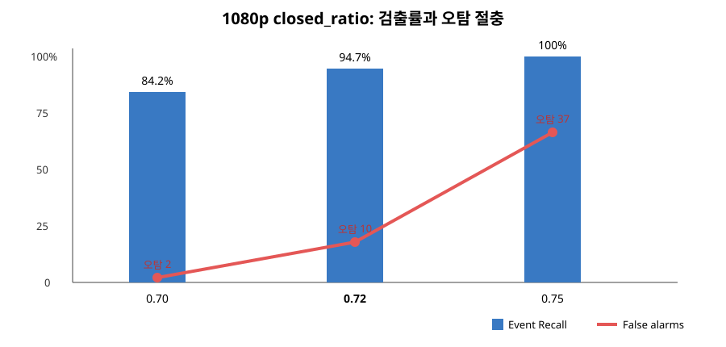
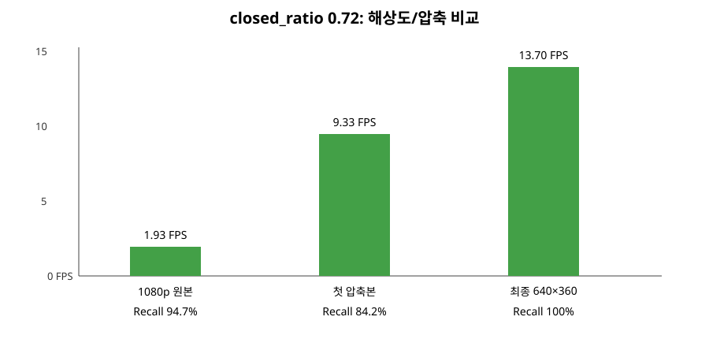
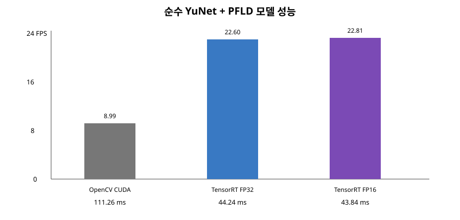
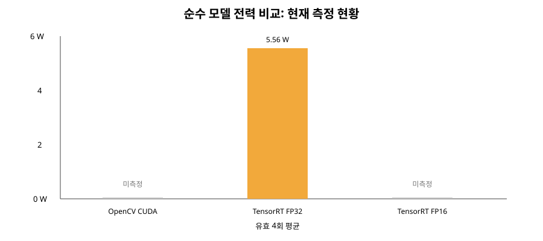

# ZZM 프로젝트 및 실험 결과

## 1. 프로젝트 목표

이 프로젝트의 목표는 Jetson Nano 한 대에서 운전자의 얼굴과 68개 얼굴
랜드마크를 실시간으로 추론하고, 눈 감김·PERCLOS·하품을 종합해 다음 동작을
결정하는 것입니다.

| 위험 단계 | 판단 예 | 시스템 요청 |
|---|---|---|
| `NORMAL` | 위험 조건 없음 | 출력 없음 |
| `PRE_DROWSY` | 반복 하품 또는 PERCLOS 주의 | 경고 부저 |
| `DROWSY` | 1.7초 연속 눈 감김 또는 PERCLOS 경고+하품 | 비상 부저, 비상등, 안전 정차 요청 |

성공 기준은 단순히 가장 빠른 모델이 아닙니다. 눈 감김 이벤트 Recall 90%
이상, 위험 경고 지연 2.5초 이하를 우선 만족하면서 오탐과 Jetson의 지연·전력·
온도를 낮추는 구성을 찾는 것입니다.

## 2. 전체 처리 구조

```text
카메라/영상
  -> YuNet 얼굴 검출
  -> 얼굴 crop
  -> PFLD 68 landmarks
  -> EAR(눈) / MAR(입) 계산
  -> [눈 감김 FSM] + [하품 FSM] + [PERCLOS]
  -> 종합 위험 FSM (NORMAL / PRE_DROWSY / DROWSY)
  -> OpenCV overlay + Qt dashboard + buzzer + hazard/stop request
  -> frame/summary CSV
```

`stop_request`는 물리 버튼이 아니라 상위 차량 제어기에 전달할 논리적 요청입니다.
현재 코드는 실제 차량을 즉시 정지시키지 않으며, 안전한 감속·정차는 별도 차량
제어기가 수행해야 합니다.

## 3. 1080p 눈 감김 파라미터 비교

공통 조건은 `final_test_0727_14_30.mp4` 1920×1080, 정답 눈 감김 이벤트
19건, `reopen_ratio=0.85`, `danger_seconds=1.7`입니다. `closed_ratio`는
보정 중 열린 눈 EAR 대비 현재 EAR의 비율이며, 값이 높을수록 눈 감김을 더
민감하게 판정합니다.

| closed ratio | 이벤트 Recall | 검출/정답 | 오탐 | 오탐/분 | Frame Precision | Frame Recall | F1 | 판단 |
|---:|---:|---:|---:|---:|---:|---:|---:|---|
| 0.70 | 84.2% | 16/19 | 2 | 0.36 | 85.7% | 73.2% | 79.0% | 오탐은 적지만 3건 누락 |
| **0.72** | **94.7%** | **18/19** | **10** | **1.80** | **77.9%** | **86.0%** | **81.8%** | Recall·F1 절충안 |
| 0.75 | 100.0% | 19/19 | 37 | 6.66 | 66.4% | 91.6% | 77.0% | 전부 검출하지만 오탐 과다 |



프로젝트 목표 관점에서 **0.72를 채택**했습니다. 0.70은 Recall 90% 목표에
미달하고, 0.75는 오탐이 급격히 증가합니다. 다만 0.72도 오탐 목표
0.33건/분을 만족하지 못하므로 실제 주행 데이터로 후속 튜닝이 필요합니다.

원자료: `score_fsm.csv`(0.70), `score_072.csv`(0.72),
`score_tuned.csv`(0.75), 각 `metrics_report_*.csv`.

## 4. closed ratio 0.72에서 영상 압축 효과

1080p 원본을 640×360/30 FPS H.264로 변환한 뒤 동일한 라벨과 파라미터로
비교했습니다. 첫 압축 실행(`final_test.mp4`)과 재생성한 최종 압축본
(`final_test_640x360.mp4`)을 구분해 기록합니다.

| 입력 | 이벤트 Recall | 오탐 | Frame F1 | E2E FPS | 평균 추론 | 평균 프레임 |
|---|---:|---:|---:|---:|---:|---:|
| 1080p 원본 | 94.7% | 10 | 81.8% | 1.93 | 469.65 ms | 517.72 ms |
| 640×360 첫 압축본 | 84.2% | 4 | 76.6% | 9.33 | 83.76 ms | 107.22 ms |
| 640×360 최종 압축본 | 100.0% | 8 | 84.1% | 13.70 | 64.04 ms | 72.99 ms |



최종 압축본은 1080p 대비 E2E FPS가 약 **7.1배**, 평균 추론은 약
**7.3배** 개선됐고 이벤트 Recall도 유지됐습니다. 두 압축 실행의 정확도가
다르므로 발표에서는 최종 압축본을 사용하되, 압축 코덱·생성 파일·명령을 고정해야
재현 가능하다는 점을 함께 밝힙니다.

## 5. 순수 모델 백엔드 비교

디코딩, FSM, EAR/MAR, overlay, 화면 표시, 영상 저장을 제외하고 YuNet+PFLD만
측정했습니다. 세 백엔드 모두 동일 영상 9,994프레임, warm-up 30프레임,
YuNet `640×640 letterbox`, PFLD `112×112` 조건입니다.

| 백엔드 | 정밀도/런타임 | 얼굴 검출률 | 평균 결합 지연 | P95 결합 지연 | 모델 FPS |
|---|---|---:|---:|---:|---:|
| OpenCV CUDA | FP32, OpenCV DNN | 98.57% | 111.26 ms | 119.92 ms | 8.99 |
| TensorRT FP32 | FP32 engine | 98.57% | 44.24 ms | 45.58 ms | 22.60 |
| **TensorRT FP16** | **FP16 engine** | **98.57%** | **43.84 ms** | **44.74 ms** | **22.81** |



TensorRT FP32는 OpenCV CUDA보다 약 **2.51배**, TensorRT FP16은 약
**2.54배** 높은 모델 FPS를 보였습니다. FP16과 FP32의 얼굴 검출률이 같으므로
이 데이터에서는 FP16으로 인한 검출 손실이 확인되지 않았습니다. FP16의 FP32
대비 추가 향상은 약 0.9%로 작으며, Jetson Nano에서는 YuNet 전후처리와 메모리
전송이 남아 있기 때문으로 해석할 수 있습니다.

## 6. 전력·온도 비교 현황

전력 실험은 MAXN, `jetson_clocks`, 500 ms 수집, 같은 순수 모델 벤치마크를
원칙으로 합니다. 현재 확보된 유효 자료는 TensorRT FP32 run1/3/4/5 네 번이며,
run2는 3,000프레임 부근 exit 139로 중단되어 제외했습니다.

| 백엔드 | 유효 반복 | 총전력 평균 | GPU 전력 | GR3D | CPU 온도 | GPU 온도 | 상태 |
|---|---:|---:|---:|---:|---:|---:|---|
| OpenCV CUDA FP32 | 0/3 | — | — | — | — | — | 측정 필요 |
| TensorRT FP32 | 4회 | 5.56 W | 2.55 W | 73.55% | 31.79°C | 30.21°C | 확보 |
| TensorRT FP16 | 0/3 | — | — | — | — | — | 측정 필요 |



따라서 지금 단계에서는 “TensorRT FP32가 다른 모델보다 전력을 덜 쓴다”는
결론을 내릴 수 없습니다. CUDA와 FP16을 각각 3회 완료한 뒤 세 백엔드의 3회
평균과 표준편차를 비교해야 합니다. 실행 방법은
[`scriptsReadMe.md`](scriptsReadMe.md#전력-비교)를 따릅니다.

## 7. 실시간 전체 시스템 실행

```bash
cd ~/jetson-driver-monitoring
source zzmvenv/bin/activate
source scripts/use_opencv_cuda.sh

python3 scripts/run_eye_monitor.py \
  --camera 0 --width 640 --height 480 --fps 30 \
  --face-backend tensorrt-fp16 \
  --landmark-backend tensorrt-fp16 \
  --closed-ratio 0.72 --reopen-ratio 0.85 --danger-seconds 1.7 \
  --yawn-open-ratio 0.18 --yawn-close-ratio 0.14 --yawn-seconds 0.3 \
  --perclos-window 30 --perclos-caution 0.15 --perclos-warning 0.30 \
  --buzzer-pin 33 --gpio-numbering BOARD \
  --passive-buzzer-frequency 1800 \
  --qt-dashboard
```

TensorRT 엔진은 Jetson/TensorRT/CUDA 버전에 종속되므로 대상 Jetson에서 다시
생성하는 것이 원칙입니다. 모델 파일은 `.gitignore` 대상이어서 Git clone만으로
설치되지 않습니다.

## 8. 문서 지도

- [scriptsReadMe.md](scriptsReadMe.md): 실행·엔진 생성·실험 명령
- [drowsinessReadMe.md](drowsinessReadMe.md): 눈 FSM, 하품 FSM, 종합 위험 FSM
- [benchmarkReadMe.md](benchmarkReadMe.md): 평가 방식과 CSV 스키마
- [modelsReadMe.md](modelsReadMe.md): 모델 및 엔진 배치
- [dataReadMe.md](dataReadMe.md): 영상·라벨·압축 조건
- [outputsReadMe.md](outputsReadMe.md): 결과물 위치와 Git 정책
- [srcReadMe.md](srcReadMe.md): 초기 코드와 현재 코드 구분
- [testsReadMe.md](testsReadMe.md): 테스트 실행법

## 9. 결과 해석 시 주의사항

- 파라미터/압축 실험은 전체 영상 파이프라인 결과이고, 순수 백엔드 실험은 모델
  추론만 측정한 결과이므로 FPS를 서로 직접 비교하지 않습니다.
- `event_recall`은 실제 눈 감김 구간을 한 번이라도 검출했는지, `frame_recall`은
  눈 감김 프레임을 얼마나 맞혔는지 나타냅니다.
- TensorRT 엔진 파일과 영상·결과 CSV는 기본적으로 Git에 올라가지 않습니다.
- 전력 비교는 같은 입력, 전원 모드, 클럭, warm-up, 냉각 휴식, 반복 횟수를
  맞춘 결과만 사용합니다.
